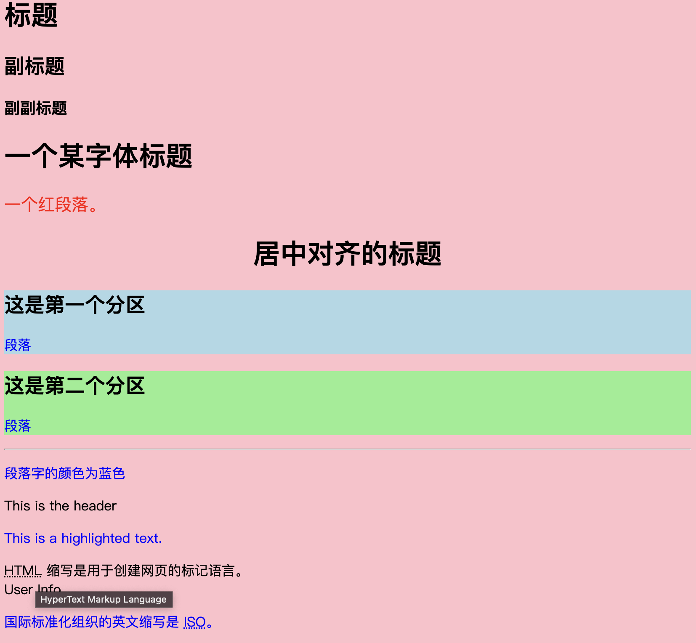
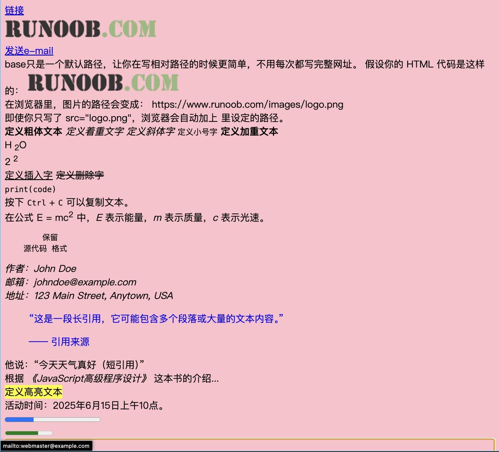
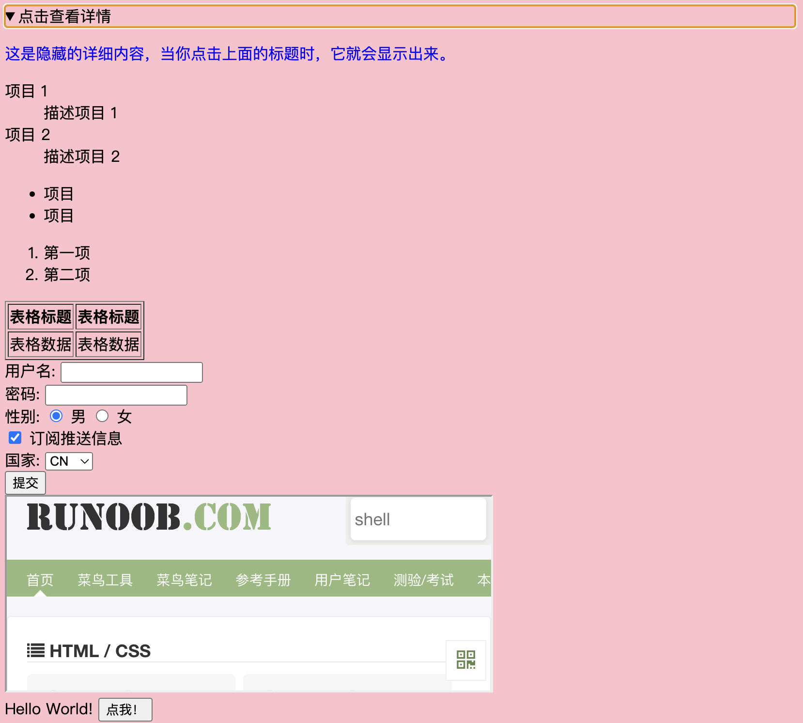

# HTML


```html
<!DOCTYPE html>
<html>
<head>

<meta charset="utf-8">
<title>first_demo</title>
<style>
    /* 为两个 div 设置不同的背景颜色，方便区分 */
    .section1 {
        background-color: lightblue;
    }

    .section2 {
        background-color: lightgreen;
    }
body {background-color:pink;}
p {color:blue;}
</style>

<link rel="stylesheet" type="text/css" href="mystyle.css">
<!--将外部的 CSS（层叠样式表）文件链接到 HTML 文档中，让 HTML 页面能够应用该 CSS 文件里定义的样式
其中，mystyle.css是我编写的css文件
-->
</head>
```




```html
<body>

 <!--这是注释的方法-->
<h1>标题</h1>
<h2>副标题</h2>
<h3>副副标题</h3>
<h1 style="font-family:verdana;">一个某字体标题</h1>
<p style="font-family:arial;color:red;font-size:20px;">一个红段落。</p>
<h1 style="text-align:center;">居中对齐的标题</h1>

<!-- 第一个 div 区域 -->
<div class="section1">
    <h2>这是第一个分区</h2>
    <p>段落</p>
</div>
<!-- 第二个 div 区域 -->
<div class="section2">
    <h2>这是第二个分区</h2>
    <p>段落</p>
</div>
<hr><!--水平线-->

<p>段落字的颜色为蓝色</p>

<!--id：为元素指定唯一的标识符。-->
<div id="header">This is the header</div>

<!--class：为元素指定一个或多个类名，用于 CSS 或 JavaScript 选择。-->
<p class="text highlight">This is a highlighted text.</p>


<!--title：为元素提供额外的提示信息，通常在 鼠标悬停 时显示。-->
<abbr title="HyperText Markup Language">HTML</abbr> 缩写是用于创建网页的标记语言。
<!--data-*：用于存储自定义数据，通常通过 JavaScript 访问。-->
<div data-user-id="12345">User Info</div>

<!--abbr表示标注缩写词-->
<p>国际标准化组织的英文缩写是 <abbr title="International Organization for Standardization">ISO</abbr>。</p>
<a href="https://www.runoob.com">链接</a>
<br><!--换行-->

<!--alt属性是对图像的描述，当图像无法显示时，会显示这个描述。-->
<br>
<a href="mailto:webmaster@example.com">发送e-mail</a>
<br>
base只是一个默认路径，让你在写相对路径的时候更简单，不用每次都写完整网址。

假设你的 HTML 代码是这样的：

<base href="https://www.runoob.com/images/">

<br>
在浏览器里，图片的路径会变成：
https://www.runoob.com/images/logo.png
<br>
即使你只写了 src="logo.png"，浏览器会自动加上 <base> 里设定的路径。
<br>
```



```html
<b>	 定义粗体文本 </b>
<em> 定义着重文字 </em>
<i>	 定义斜体字 </i>
<small>	定义小号字</small>
<strong>定义加重文本</strong>
<br>
H<sub>	2</sub>O
<br>
2<sup>	2</sup>
<br>
<ins>	定义插入字</ins>
<del>	定义删除字</del>
<br>
<code>	print(code) </code>
<br>
按下 <kbd>Ctrl</kbd> + <kbd>C</kbd> 可以复制文本。
<br>
在公式 E = mc<sup>2</sup> 中，<var>E</var> 表示能量，<var>m</var> 表示质量，<var>c</var> 表示光速。
<pre>	保留
    源代码 格式
</pre>

<address>
    作者：John Doe<br>
    邮箱：johndoe@example.com<br>
    地址：123 Main Street, Anytown, USA
</address>

<blockquote>
    <p>“这是一段长引用，它可能包含多个段落或大量的文本内容。”</p>
    <p>—— 引用来源</p>
</blockquote>

他说：<q>今天天气真好（短引用）</q>
<br>

根据 <cite>《JavaScript高级程序设计》</cite> 这本书的介绍...
<br>
<mark>	定义高亮文本</mark>
<br>
活动时间：<time datetime="2025-06-15T10:00:00">2025年6月15日上午10点</time>。
<br>
<!-- 假设任务总进度是 100，当前完成了 30 -->
<progress value="30" max="100"></progress>
<br>
<!-- 表示当前度量值是 70，范围是 0 - 100 -->
<meter value="70" min="0" max="100"></meter>
</body>
<details>
    <summary>点击查看详情</summary>
    <p>这是隐藏的详细内容，当你点击上面的标题时，它就会显示出来。</p>
</details>
```



```html
<dl>
    <dt>项目 1</dt>
      <dd>描述项目 1</dd>
    <dt>项目 2</dt>
      <dd>描述项目 2</dd>
  </dl>
<!--定义列表-->
<ul>
    <li>项目</li>
    <li>项目</li>
</ul>

<ol>
    <li>第一项</li>
    <li>第二项</li>
</ol>

<table border="1">
<!--border属性规定表格边框的宽度-->
    <tr>
      <th>表格标题</th>
      <th>表格标题</th>
    </tr>
    <tr>
      <td>表格数据</td>
      <td>表格数据</td>
    </tr>
  </table>

  <form action="/" method="post">
    <!-- 文本输入框 -->
    <label for="name">用户名:</label>
    <input type="text" id="name" name="name" required>

    <br>

    <!-- 密码输入框 -->
    <label for="password">密码:</label>
    <input type="password" id="password" name="password" required>

    <br>

    <!-- 单选按钮 -->
    <label>性别:</label>
    <input type="radio" id="male" name="gender" value="male" checked>
    <label for="male">男</label>
    <input type="radio" id="female" name="gender" value="female">
    <label for="female">女</label>

    <br>

    <!-- 复选框 -->
    <input type="checkbox" id="subscribe" name="subscribe" checked>
    <label for="subscribe">订阅推送信息</label>

    <br>

    <!-- 下拉列表 -->
    <label for="country">国家:</label>
    <select id="country" name="country">
        <option value="cn">CN</option>
        <option value="usa">USA</option>
        <option value="uk">UK</option>
    </select>

    <br>

    <!-- 提交按钮 -->
    <input type="submit" value="提交">
</form>

<iframe src="https://www.runoob.com" width="500" height="200"></iframe>
<!--iframe元素会创建包含另一个文档的内联框架(嵌套网页)-->
<br>

<script>
document.write("Hello World!");
</script>
<!--JavaScript 代码可以直接写在 HTML 代码里，也可以写在外部文件里，然后通过 <script> 标签引入。-->
<button type="button" onclick="myFunction()">点我！</button>
<noscript>抱歉，你的浏览器不支持 JavaScript!</noscript>

<!--超文本传输协议	以 http:// 开头的普通网页。不加密。
    安全超文本传输协议	安全网页，加密所有信息交换。
-->

</body>
</html>
```