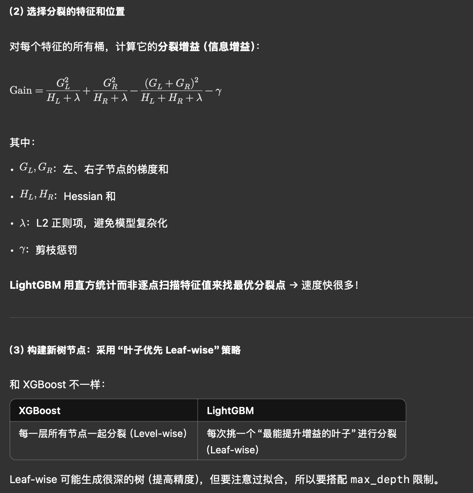
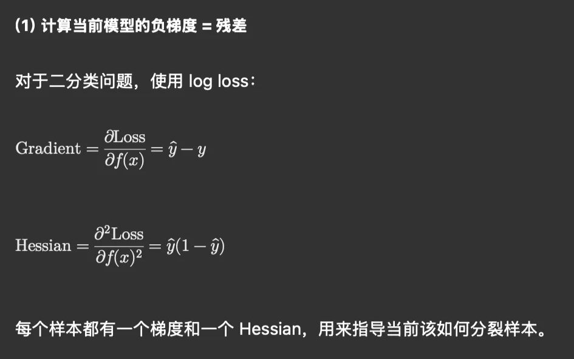
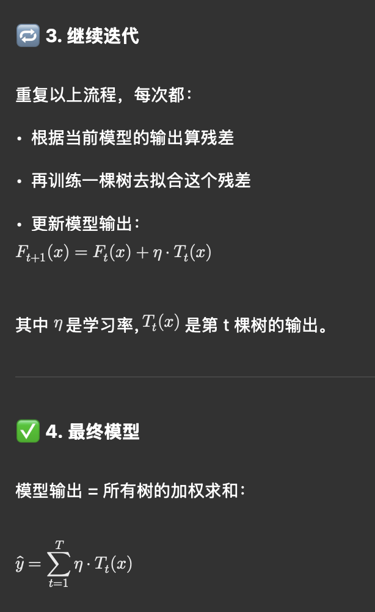

---
authors:
- william
date: '2025-04-18'
summary: ' '
tags: [ML]
title: LightGBM
---

# LightGBM

##  LightGBM 相比 XGBoost 有哪些核心改进？

| **改进** | **LightGBM 的做法** | **有什么用** |
| --- | --- | --- |
|  样本使用方式 | **基于直方的决策树学习算法（Histogram）** | 把连续特征离散成几个桶，加快计算，降低内存占用 |
|  样本增长方式 | **Leaf-wise（叶子优先）** | 每次从所有叶子中选出增益最大的叶子进行分裂（而不是按层扩展）→ 更快、更准 |
|  特征按需 | **GOSS（Gradient-based One-Side Sampling）** | 对梯度小的样本进行采样，只保留梯度大的重要样本 |
|  特征选择 | **EFB（Exclusive Feature Bundling）** | 把互斥的稀疏特征合并，减少维度 |
|  支持稀疏数据 | 内置稀疏感知机制（zero-aware） | 自动处理缺失值、稀疏矩阵，无需额外预处理 |

##  LightGBM 和 XGBoost 对比

| **特性** | **XGBoost** | **LightGBM** |
| --- | --- | --- |
| 树生长策略 | Level-wise（按层） | Leaf-wise（按增益） |
| 特征离散化 | 不做离散化 | 使用 histogram 离散化 |
| 特征选择 | 全部参与 | 支持 GOSS + EFB（更快） |
| 稀疏处理 | 基本支持 | 原生支持（更优） |
| 精度 | 稍弱（在同参数下） | 通常更高（但也更易过拟合） |
| 训练速度 | 较快 | 非常快 |
| 大数据支持 | 好 | **更强！** |
| 稳定性 | 稳定泛化 | 更容易过拟合，需要调参控制 |

##  实践建议（什么时候用 LightGBM 更香？）

| **适用场景** | **原因** |
| --- | --- |
| 特征很多、维度稀疏 | EFB + 稀疏支持 |
| 样本量巨大 | GOSS 采样策略节省资源 |
| 需要快速迭代 | 训练快、占内存小 |
| 排序类问题（比如推荐） | 原生支持 Ranking 模式 |
| Kaggle 比赛 | 高分神器（几乎都是 XGB / LGB / CatBoost） |

---

##  LightGBM 的核心训练机制详解

###  1. Leaf-wise 树生长（区别于 XGBoost 的 Level-wise）

- XGBoost 是“按层扩展”树，每一层都增加一定数量的叶子节点。
- LightGBM 是“从当前最有希望的叶子扩展”，**增益最大的叶子优先分裂**。

> 优点：更快收敛，准确率更高
> 

> 缺点：容易过拟合（尤其在小数据上）
> 

###  2. Histogram 算法

- 把连续特征**离散成 k 个桶**（默认256个）
- 训练过程中不再计算每个值的增益，而是直接在桶上做累积统计

>  大幅减少内存 & 加快训练
> 

> 类似：从精细画画变成“像素风格涂色”
> 

---

##  LightGBM 的核心流程（以分类为例）

---

###  总览流程：

```
数据输入 → 离散化（Histogram） → 构建第一棵树 → 计算残差（负梯度）
→ 选出最优分裂特征与位置 → 构建下一棵树（继续拟合残差）
→ 多轮迭代 → 最终模型 = 所有树的加权和
```

---

### 数据准备 + 离散化（Histogram 构建）

- 首先，对所有的连续数值型特征进行分桶（binning)处理（默认256个桶）。
- 例如，把“年龄”这个特征（取值范围 0~100）划分为 256 个桶，那么我们只需要记录：样本属于哪个桶、每个桶的梯度和 Hessian 之和。
- 这一步是 LightGBM 的“提速核心”，把浮点数操作换成整数索引，大幅提高效率。

---

### 迭代训练（Boosting）主流程

LightGBM 是 Boosting 框架，每轮训练一棵新树，这棵树是为了“修正前一轮的错误”







---

##  总结一页图（知识地图）

```
本质：Gradient Boosting 框架
损失：逐步拟合负梯度（残差）
 树构建：
   - Leaf-wise（按增益优先分裂）
   - 使用 Histogram 离散特征
   - 剪枝 & 正则化抑制过拟合
 优化：
   - GOSS（保留高梯度样本）
   - EFB（合并稀疏互斥特征）
 模型输出 = 多棵树输出的加权和
```

---

##  问题 1：分桶（Histogram Binning）到底干了啥？为什么能加速？

---

###  背景：我们训练树模型时，需要对每个特征找「最佳切分点」，这很慢！

比如一个数值特征“年龄”，样本是：

```
[25, 32, 44, 21, 37, 60, 28, 49, 36]
```

如果你要建树，你得枚举每一个可能的分裂点：

```
比如在 25/28、28/32、32/36 之间都试一遍，看谁分裂后信息增益最大
```

>  这种方式非常慢，尤其是特征多、样本多时，要扫描所有样本。
> 

---

###  分桶做了什么？

 LightGBM 会在训练前，把“连续值”特征**离散成固定的桶（bin）**。

比如我们设定 4 个桶（实际中常用 255~512 个）：

| **样本值** | **所属桶** |
| --- | --- |
| 21 | bin0 |
| 25 | bin0 |
| 28 | bin1 |
| 32 | bin1 |
| 36 | bin2 |
| 37 | bin2 |
| 44 | bin3 |
| 49 | bin3 |
| 60 | bin3 |

然后它只需要枚举桶之间的边界，比如：

- bin0 vs bin1
- bin1 vs bin2
- bin2 vs bin3

来计算分裂点，而不是枚举所有具体值。

---

##  问题 2：什么是 Leaf-wise？怎么和 XGBoost 的 Level-wise 不一样？

---

###  Level-wise：按“层”来生长树（XGBoost）

假设你现在训练到第一层了（根节点），你会：

```
→ 把所有叶子节点都扩展一层（2个 → 4个 → 8个）
```

这种方式结构整齐，**适合并行计算**，但：

>  有的分裂没啥用（增益低），也要做
> 

>  每层都扩，可能做了很多“无效”的工作
> 

---

###  Leaf-wise：LightGBM 的方式：

### 每次都找出增益最大的叶子扩展

比如当前的树是这样：

```
      Root
     /    \
    L1    L2
         /  \
       L3   L4
```

它会去看每个叶子的分裂潜力（信息增益大）（分裂谁让混乱减少的多），比如：

| **叶子** | **分裂信息增益** |
| --- | --- |
| L1 | 0.3 |
| L3 | 0.1 |
| L4 | 0.8 ←最大 |

 它就**优先分裂 L4**，生成新的更深的叶子。

因为只有继续分裂”错得多”的叶子，模型的整体误差才能下降得最快

---

### ** 好处：**

- 精力集中：只扩展对精度贡献最大的地方
- 学得快：收敛速度更快
- 树不规则、可能不平衡，但准确率更高

---

##  问题 3：GOSS 是什么？为什么叫 One-Side Sampling？

---

###  背景问题：样本太多，训练太慢 → 要不要采样一部分样本来训练？

> 普通的随机采样，会把“难样本”和“容易样本”都随机抽一部分出来。
> 

---

###  GOSS 的策略：

### **不动“难样本”，只从“容易样本”里采样**

- LightGBM 会先算出每个样本的“残差（梯度）”
- 残差大 → 模型错得离谱 → 重要样本
- 残差小 → 模型基本对了 → 次要样本

---

###  GOSS 策略：

- 取 **top 20% 残差最大的样本**（保留所有“困难样本”）
- 再从剩下的 80% 里**随机采样一部分“容易样本”**（比如 10%）

这样就能：

>  保留训练重点样本，提升训练效率
> 

>  同时保证对全局样本的泛化能力
> 

>  比随机采样更高效、更有代表性！
> 

---