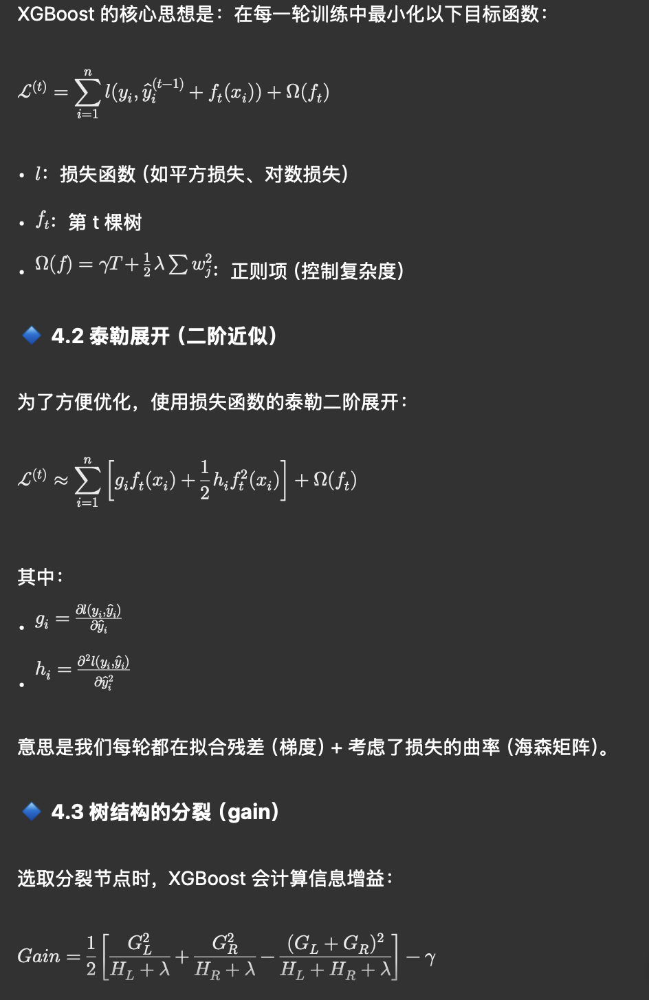

---
authors:
- william
date: '2025-04-16'
summary: XGBoost 是一种梯度提升树（GBDT）的优化版本。
tags: [LM]
title: xgboost
---

# xgboost

XGBoost 是一种**梯度提升树（GBDT）的优化版本。**

**它通过不断训练新的树来修正前面树的残差**。

Boosting 是一种集成学习策略：

多个弱分类器（如深度小的决策树） **串联** 组合成一个强分类器。

每个新的模型都试图 **修正前一个模型的错误**。

### **🔷 比喻一：建造团队**

| **模型** | **比喻** | **行为逻辑** |
| --- | --- | --- |
| 随机森林 | 多个工人**独立施工**，最后**投票表决** | 每棵树独立训练，对最终结果都有“平等话语权” |
| XGBoost | 工人**一棵接一棵来补救错误**，每次都参考上一个人的工作结果来修正 | 每棵树根据上一次的残差来训练，是一轮轮“纠错”过程 |

