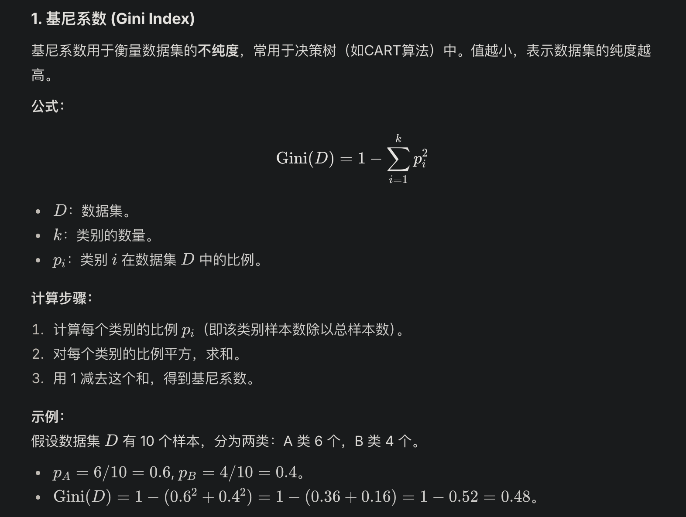
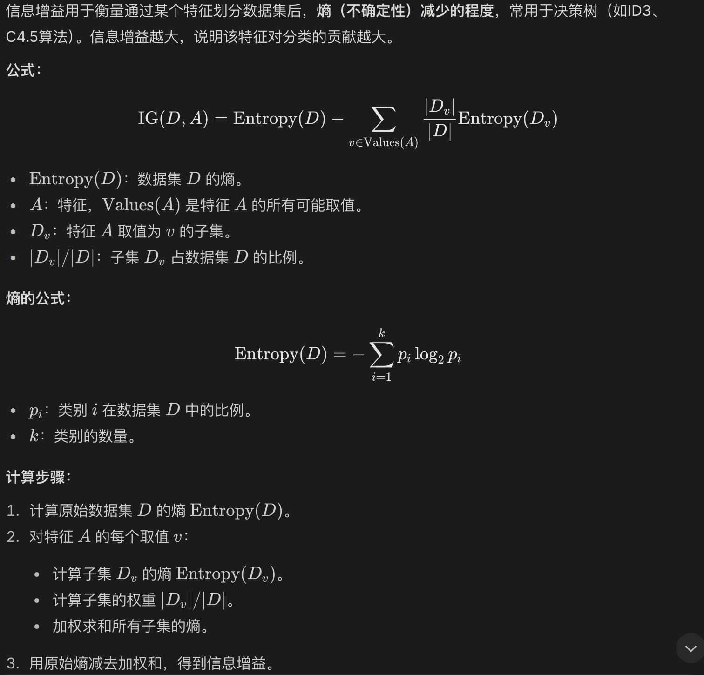
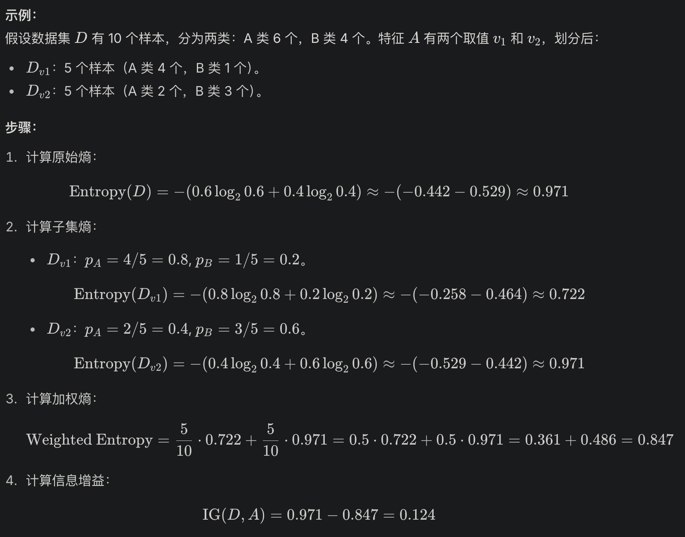

---
authors:
- william
date: '2025-04-02'
tags: [LM]
title: 决策树
---

# 决策树

---

### **📦 决策树的结构：**

- **根节点（Root）**：整个树的起点
- **内部节点（Internal Node）**：每个判断条件（特征）
- **叶子节点（Leaf）**：最终的分类或回归结果

---

## **🎯 核心问题：怎么选择“最优特征”？**

答案就是：**信息增益（Information Gain）**

### **🔑 信息增益（Information Gain）**

这个概念来自信息论，就是看在这个特征划分之后，**信息的不确定性（熵）减少了多少**。

信息增益 = 原始熵 - 条件熵

**分裂混乱的叶子信息增益大，信息不确定性减少的多**

换句话说就是：

- 如果某个结点（或叶子）**本来很混乱（信息熵高）**，我们对它做一个好的分裂，结果让子节点的“混乱程度”明显降低，那这个分裂就带来了**大量的“确定性”提升**，也就是说：

### **👉 信息增益（Information Gain）很大 ✅**

### **其他常见的划分标准：**

| **名称** | **概念简介** |
| --- | --- |
| 信息增益 | 选择后让熵下降最多 |
| 信息增益比 | 信息增益 / 特征本身的熵，防止偏向多值特征 |
| 基尼系数（Gini） | 用于 CART 树，衡量“纯度” |

---

## **🧱 决策树的构造算法：**

| **算法名称** | **特点** |
| --- | --- |
| ID3 | 使用信息增益 |
| C4.5 | 使用信息增益比（防止偏向） |
| CART | 使用基尼系数（分类）或 MSE（回归）构建二叉树 |

---

## **🧠 决策树的优缺点**

### **✅ 优点：**

- 简单直观，易于解释（可视化）
- 不需要归一化、标准化
- 能处理分类和回归
- 可以处理非线性数据

### **❌ 缺点：**

- 容易**过拟合**（尤其是训练样本少时）
- 对于噪声和轻微变化比较敏感
- 有时不如复杂模型（如随机森林、XGBoost）性能高

---

## **🧩 一、什么是二叉树？**

### **📦 定义：**

**二叉树**是一种特殊的树形结构，它的每个节点最多**只能有两个子节点**（通常称为左子树和右子树）。

---

## **🌳 二、决策树一定是二叉树吗？**

**不一定！**

### **决策树有两种主流形式：**

| **树类型** | **分裂方式** | **举例算法** |
| --- | --- | --- |
| 多叉树 | 一个节点可以有多个子节点（多路分裂） | ID3、C4.5 |
| 二叉树 | 每次只分成两部分（两路分裂） | CART |

如果你以后用 scikit-learn 里的 DecisionTreeClassifier 或 DecisionTreeRegressor，默认其实是用的 **CART 算法**，所以生成的是**二叉树结构的决策树**。

---