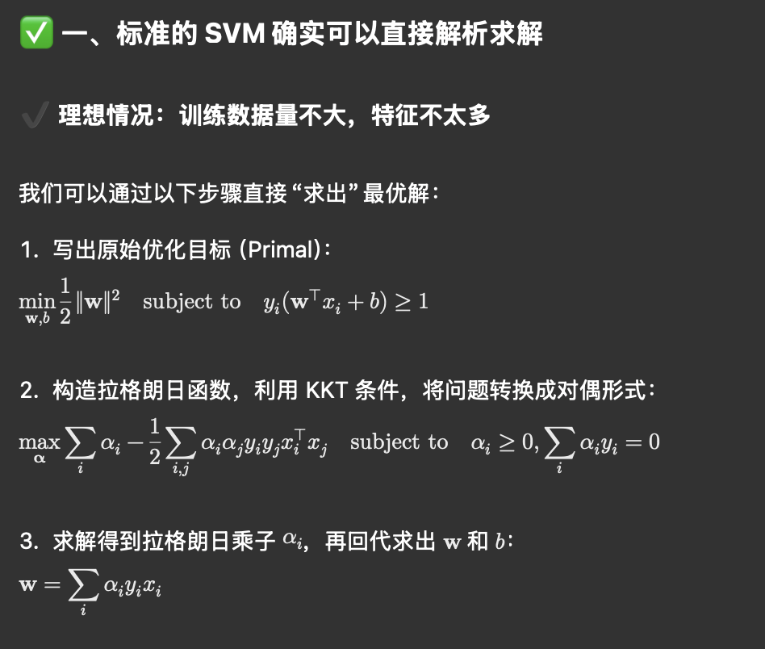

---
authors:
- william
date: '2025-04-12'
summary: ' '
tags: [ML]
title: 支持向量积
---

# 支持向量积

## **一、什么是“支持向量”？**

在 SVM（支持向量机）中：

> 支持向量（Support Vectors）是那些“离决策边界最近的样本点”。
> 

## **二、支持向量机 SVM（Support Vector Machine）**

SVM 是一个非常经典的分类器，它的目标是：

> 找到一个“最大间隔（margin）”的超平面，把两类样本分开。
> 

### **👇 标准 SVM（特别是硬间隔）是凸优化问题**

### **更新w和b不是通过经典的梯度下降，而是通过：**

- **拉格朗日对偶法（Lagrange Duality）**
- **KKT 条件**
- **二次规划（Quadratic Programming, QP）**

也就是说，SVM 是一种“可解析优化问题”——我们可以通过数学手段**求出最优解**，不一定非要用“迭代更新”。

实际中，为了效率和适应大规模数据，我们常常用 **SMO（Sequential Minimal Optimization）** 方法间接求解 SVM，它不是传统的梯度下降，而是更像“贪心解二元子问题”。

---

（注意下里面yi和括号里的东西是相乘关系。）

---

具体例子：两个点都被**分类错了**

---

SVM 有一个魔法叫**核技巧（Kernel Trick）**：

> 不用真的映射到高维，只需用“核函数”算高维中两个点的内积。
> 
- 如果你手动映射到 1000 维，那你需要存下所有𝝓(x), 又要计算高维空间里的超平面和距离，开销巨大！

常见核函数：

- 线性核（Linear）
- 多项式核（Polynomial）
- 高斯核 / RBF 核（Radial Basis Function）
- Sigmoid 核

